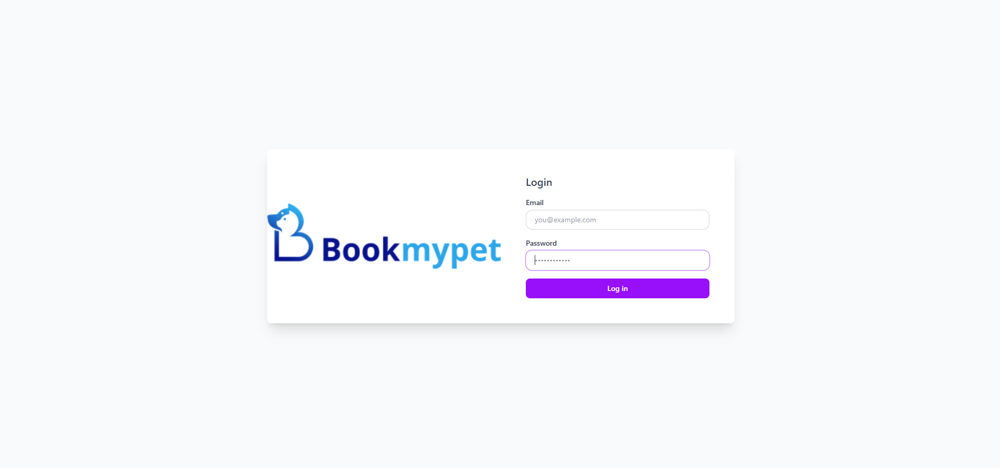
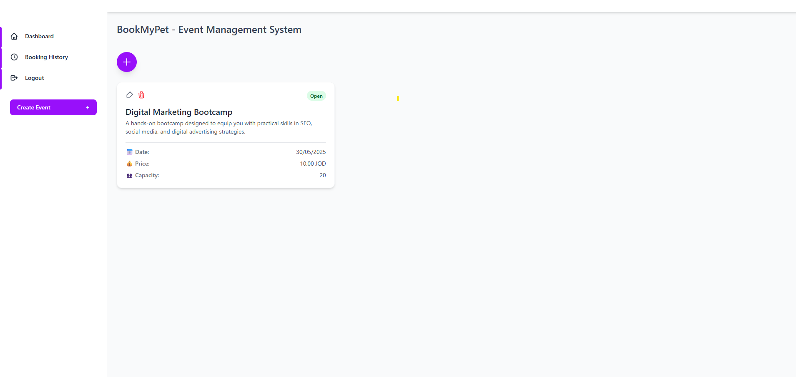
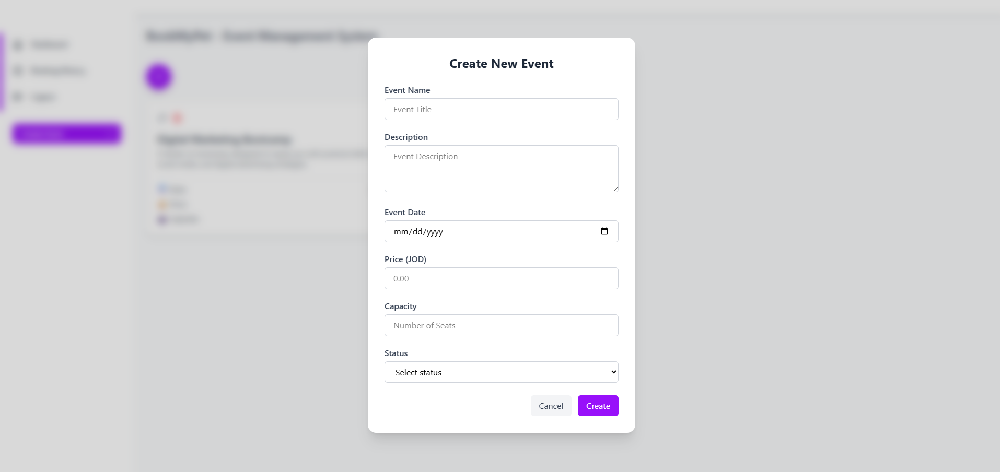
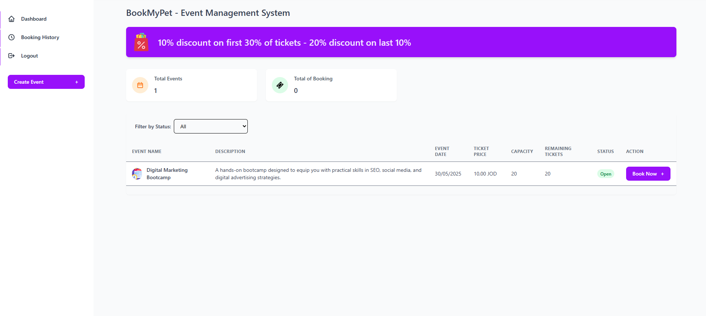
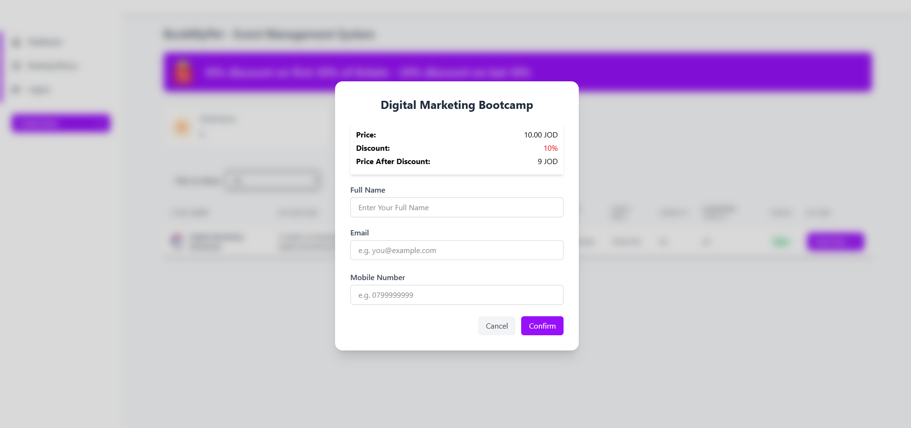
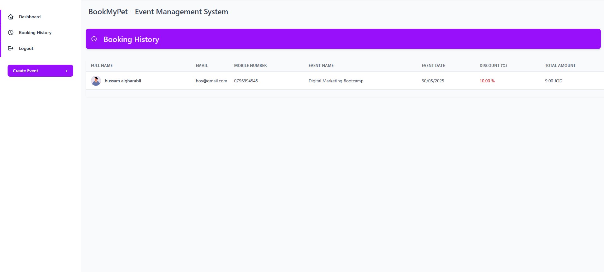

# Event Management System

This is a Laravel-based Event Management API with features for user authentication, event listings, and booking management.

---

## 📦 Project Setup

1. **Clone the Repository**
```bash
git clone https://github.com/your-username/eventManagementSystem.git
cd eventManagementSystem
```

2. **Install Dependencies**
```bash
composer install
npm install && npm run build
```

3. **Configure Environment**
```bash
cp .env.example .env
php artisan key:generate
```

4. **Set up Database**
Update your `.env` file with your DB credentials, then run:
```bash
php artisan migrate
```

5. **Run the Server**
```bash
php artisan serve
```

---

## 🐳 Docker Deployment

1. **Build and Run Containers**
```bash
docker-compose up -d --build
```

2. **Access the App**
- Backend API: `http://localhost:8000/api`

---

## 🔌 API Endpoints

### Authentication
- `POST /api/login` – Login with email and password

### Events
- `GET /api/events` – List all events
- `GET /api/events/{id}` – Get single event
- `POST /api/events` – Create event
- `PUT /api/events/{id}` – Update event
- `DELETE /api/events/{id}` – Delete event

### Bookings
- `GET /api/booking` – List bookings
- `POST /api/booking` – Create new booking

---

## 🧩 Database Schema

### Users
- `id`: Primary key
- `name`, `email`, `password`
- Timestamps

### Events
- `id`, `name`, `description`, `event_date`, `price`, `capacity`, `status`
- Timestamps

### Bookings
- `id`, `event_id`, `full_name`, `user_email`, `mobile_number`, `amount`, `total_amount`, `discount`
- Timestamps

---


## 🔐 Admin Account

An admin user is seeded by default using the `DeafultAdminSeeder`. Use the following credentials to log in as the admin:

- **Email**: `admin@bookmypet.com`
- **Password**: `bookmypet@2025`
- **Admin Login URL**: `POST /api/login`

> ⚠️ Passwords should be hashed in production. This is provided for development/demo use only.

---


## 🖼️ Screenshots

> The following are screenshots of the application interface, located in `public/booking`:
- 
- 
- 
- 
- 
- 
- 

---

## 📜 License
MIT


